# 一、系统说明

基于springboot+vue+elementui+vue开发的的超市进销存系统,系统功能齐全, 代码简洁易懂，适合小白学编程。

# 二、系统架构

######      前端：vue| elementui

######      后端：springboot | mybatis 

######      环境：jdk1.8+ | mysql8.0+ | maven

# 三、代码及数据库

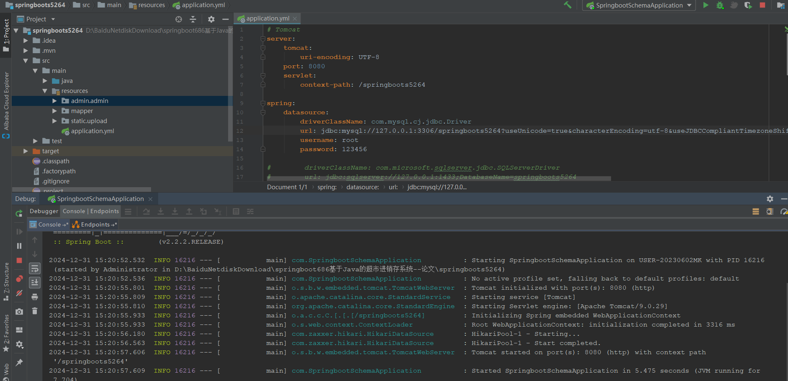

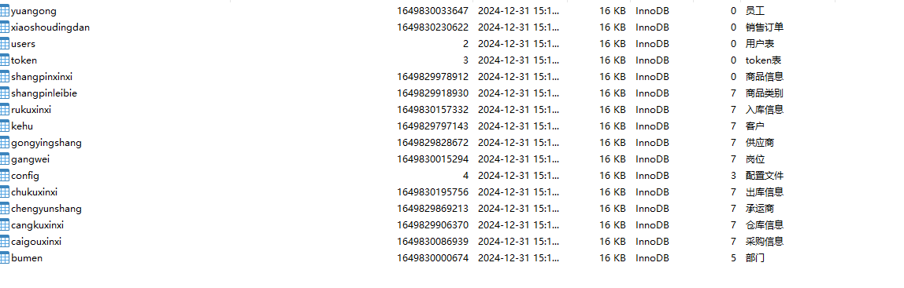

# 四、相关功能介绍

#### 1.登录

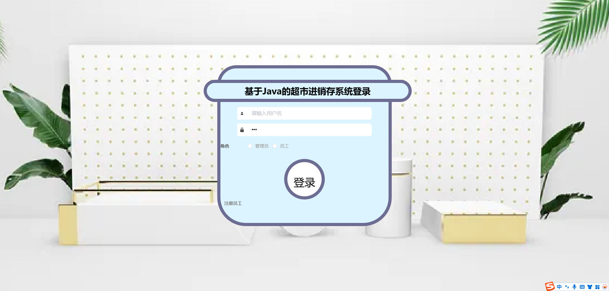

###### 2.员工注册

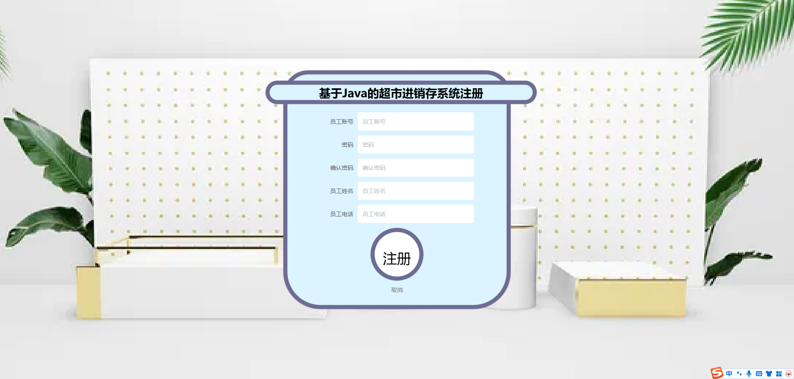

###### 3.个人中心->修改密码

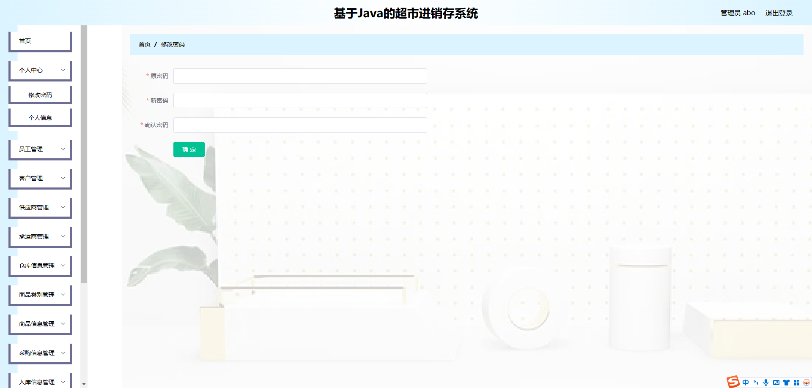

###### 4.员工管理

包含:删除、修改、新增、详情功能

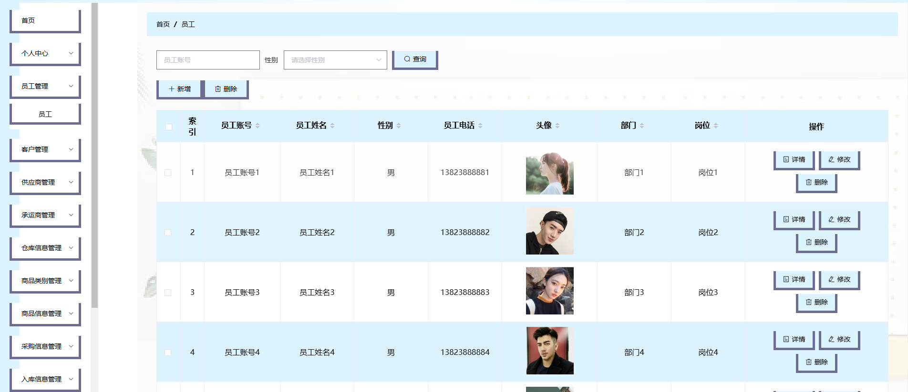

###### 4.客户管理

包含:删除、修改、新增、详情功能

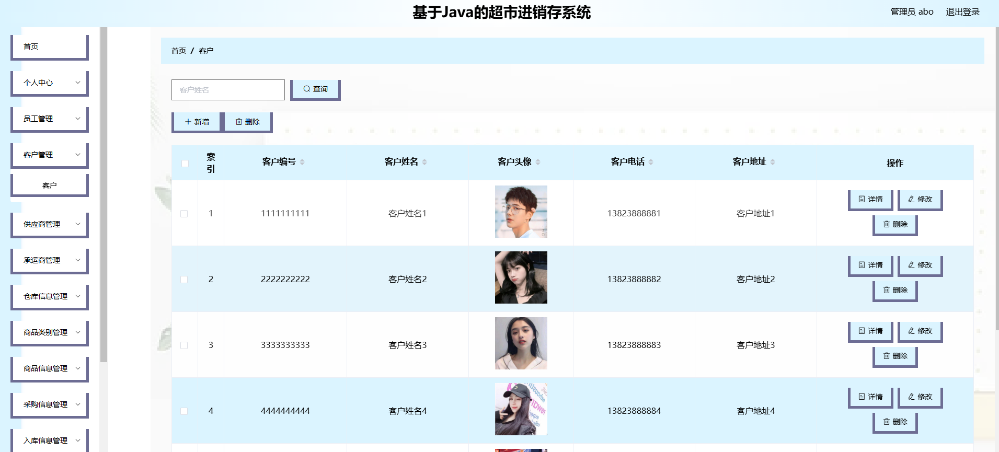

###### 5.供应商管理

包含:删除、修改、新增、详情功能

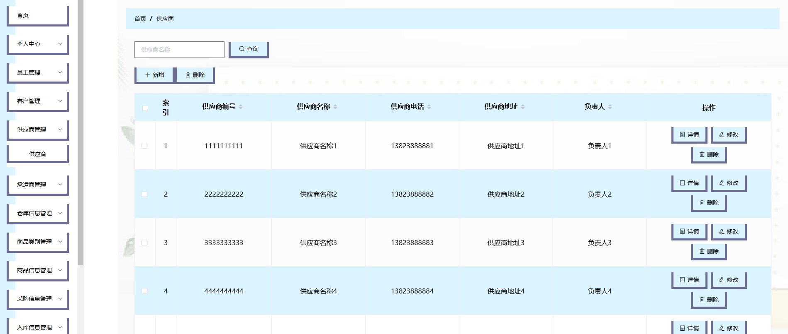

###### 6.承运商管理

包含:删除、详情、新增、修改功能

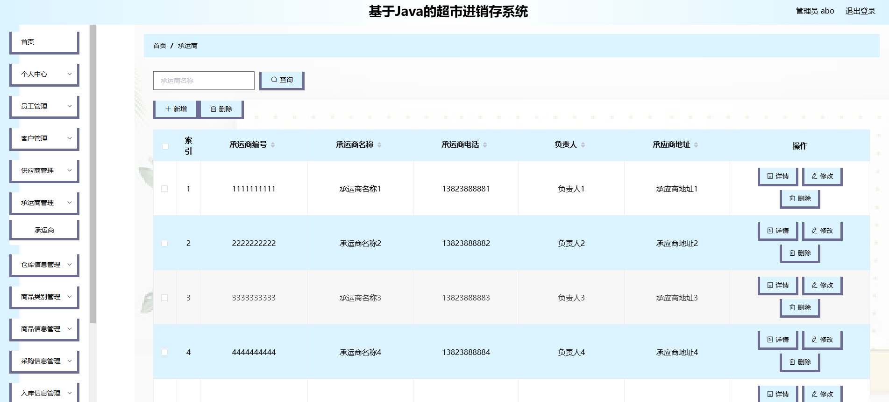

###### 7.仓库信息管理

包含:删除、详情、新增、修改功能

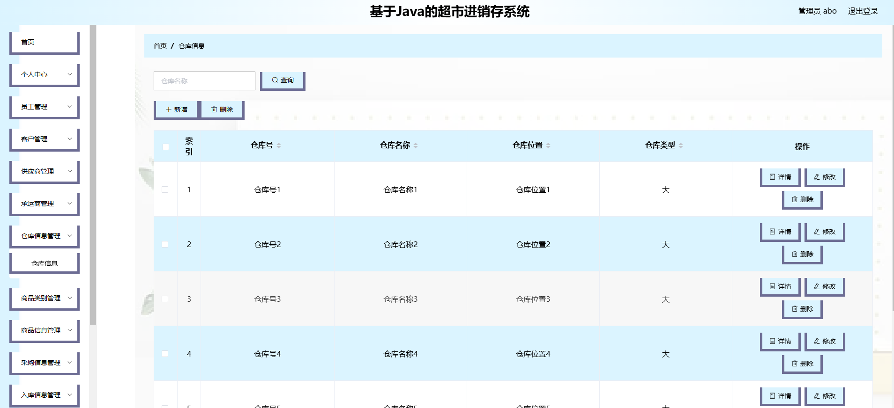

###### 8.商品类别管理

包含:删除、新增、修改功能

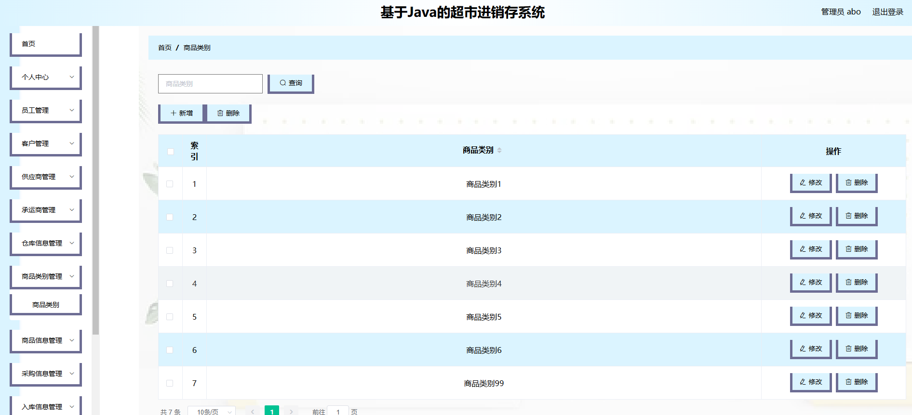

###### 9.商品信息管理

包含:删除、详情、新增、修改功能

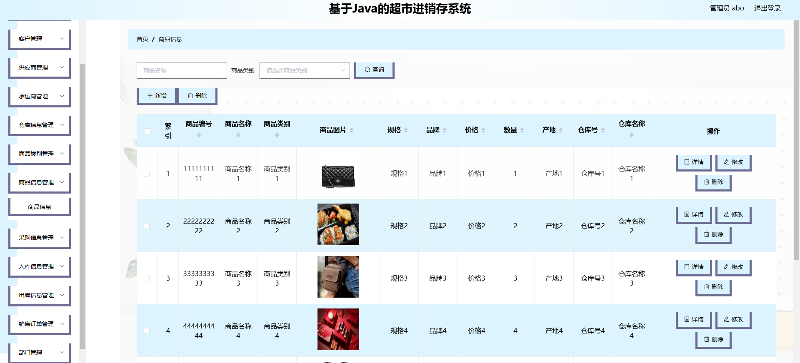

###### 10.采购信息管理

包含:修改、详情、删除、审核功能

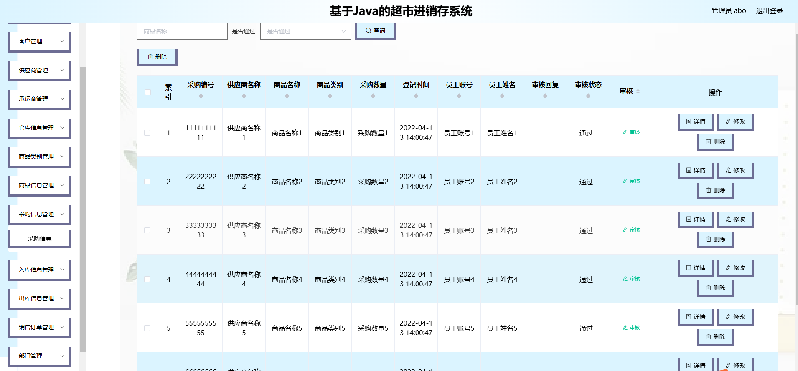

###### 11.入库信息管理

包含:修改、详情、删除功能

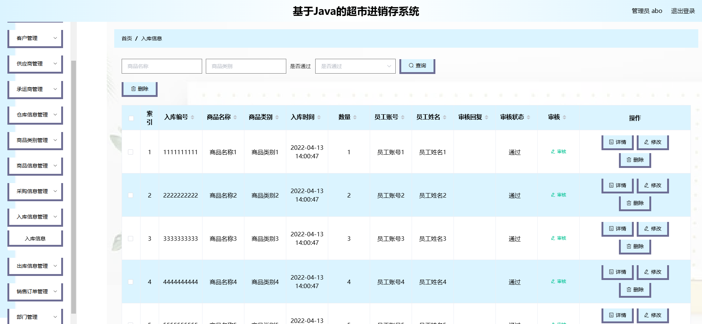

###### 12.出库信息管理

包含:修改、详情、删除功能

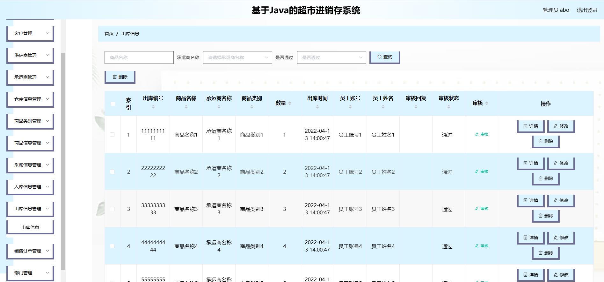

###### 13.销售订单

包含:修改、详情、删除功能

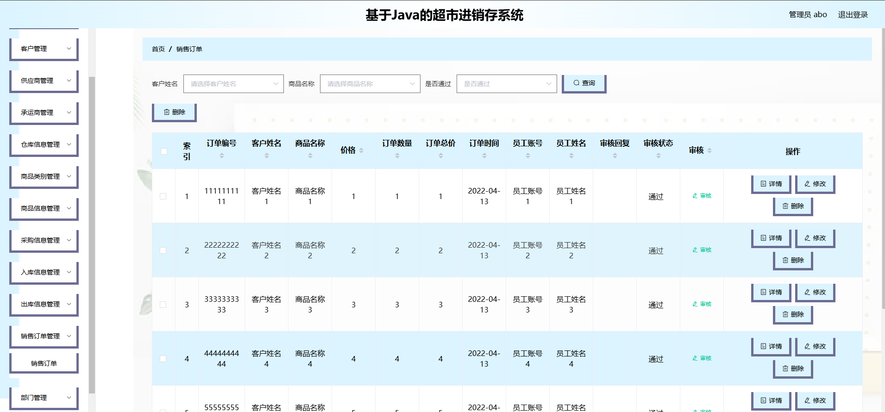

###### 14.部门管理

包含:修改、详情、删除、新增功能

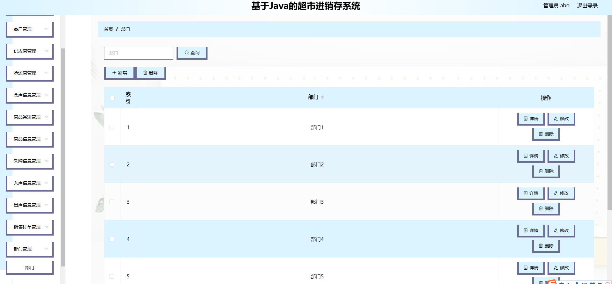

###### 15.岗位管理

包含:修改、详情、删除、新增功能

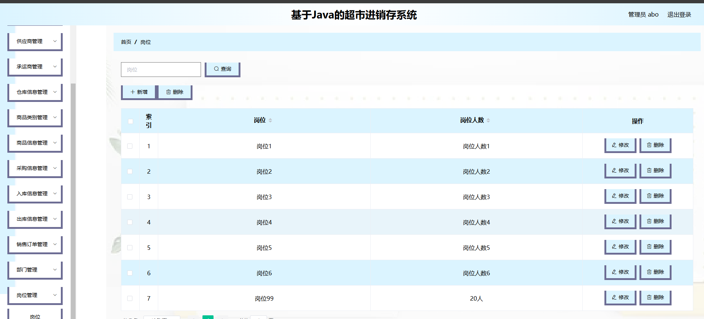

###### 16.员工登录

注:与管理端功能差不多，功能权限不一样

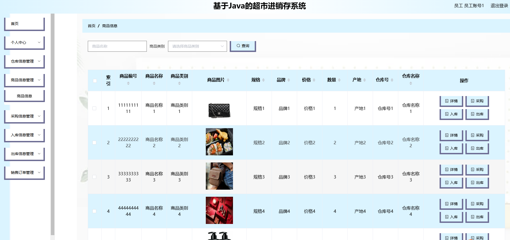
